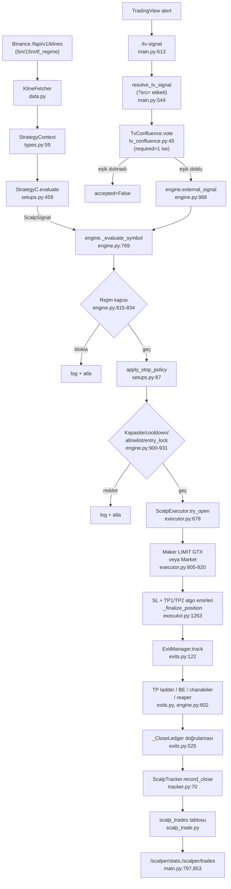

# TRADINGBOT — Mimari Doküman

Bu dosya koddan okunarak yazılmıştır (`grep`/`Read`, tahmin yok). Belirsiz kalan
her nokta "kodda doğrulanamadı" diye işaretlidir. Anchor formatı: `dosya:satır`.

## 1. Tek bakışta

- Python/FastAPI kripto vadeli işlem botu; borsa **Binance USDⓈ-M Futures**,
  ağ **TESTNET** (`binance_base_url` varsayılanı `testnet.binancefuture.com`,
  `src/core/config.py:45`; mainnet açık onay ister — §9).
- Canlıda aktif strateji: **scalper motorunun "C" varyantı** (yerel `.env`:
  `SCALPER_STRATEGIES=C`; kod varsayılanı `"A,B,C,D"`, `config.py:142`).
- Tek süreç, tek FastAPI app (`src/main.py:215`, `uvicorn src.main:app`).
  Süreç içinde eşzamanlı çalışan bileşenler (`lifespan`, `main.py:127-213`):
  1. **ScalperEngine** — otonom tarama/giriş/çıkış motoru (`scalper_enabled`
     ise), 3 arka plan task'ı: scan, safety, exchange-readiness
     (`src/strategies/scalper/engine.py:218-252`).
  2. **TradingOrchestrator** — eski Telegram-VIP-sinyal akışı; scalper'ın
     sahiplenmediği açık pozisyonları kurtarır/izler (`src/services/
     orchestrator.py:43`).
  3. **TelegramBotService** — VIP kanal mesajlarını ayrıştırıp orchestrator'a
     besler + `/status /positions` bilgi komutları (`src/services/
     telegram_bot.py:27`); supervisor ile bounded backoff'la yeniden başlatılır
     (`main.py:102-125`).
  4. **TradingView webhook köprüsü** — `/tv-signal` (`main.py:613`), harici
     yön sinyalini scalper'ın kendi giriş hattına sokar.
- Deprecated: `src/api_server.py` (kendi docstring'i: "artık aktif kullanılmıyor",
  `src/api_server.py:5`) — kullanılmamalı, `src/main.py` tektir.
- Sunucu dağıtımı (2026-08-21 sunucuda doğrulandı): `awa:/opt/tradingbot-v2`,
  **supervisord** programı `tradingbot_v2` → `.venv/bin/python -m uvicorn
  src.main:app --host 127.0.0.1 --port 9091`. Sunucu repo'su bu GitHub
  repo'sunun `main`'ini izler (`scripts/deploy.sh`). `.env` sunucuda ayrı,
  commit'lenmez. ⚠️ systemd'deki `live-bot.service` trading botu DEĞİLDİR
  (futbol botu) — bkz. `docs/RUNBOOK.md`.

## 2. Veri/karar akışı



Zaman dilimi rolleri (`engine.py:775-791`, config varsayılanı 5m/15m/4h):
`scalper_tf_entry` (giriş mumu, varsayılan 5m) → `scalper_tf_context`
(bağlam/equilibrium, 15m) → `scalper_tf_regime` (rejim; kod varsayılanı 4h,
canlı sunucu `.env`'i **15m** — 2026-08-21'de `.venv` içinden
`settings.scalper_tf_regime` okunarak doğrulandı; 4h varyantı backtest'te
boğayı yok ettiği için reddedildi, bkz. `docs/DECISIONS.md`).

### Kline veri kaynağı ve ağırlık bütçesi (D17)

Mum verisi `KlineFetcher` (`src/strategies/scalper/data.py`) üzerinden public
(imzasız) `/fapi/v1/klines`'tan gelir. Host seçimi:

| Ayar | Kline host'u | Emir/bakiye/pozisyon/ticker host'u |
|---|---|---|
| `SCALPER_MARKET_DATA_BASE_URL` boş (varsayılan) | `BINANCE_BASE_URL` | `BINANCE_BASE_URL` |
| dolu (ör. `https://fapi.binance.com`) | o host | `BINANCE_BASE_URL` (DEĞİŞMEZ) |

Yalnız kline çekimi ayrılır; `UniverseScanner` (24s ticker → evren) BİLİNÇLİ
olarak işlem host'unda kalır — evren, işlem yapılamayan sembollerle dolmamalı.
`ExitManager` motorla AYNI fetcher örneğini kullanır (`engine.py`'de
`self.fetcher.get_klines` callback'i), yani giriş ve trailing mumları hep aynı
kaynaktan gelir. Mainnet'te işlem yapılırken market-data host'u testnet olamaz
(`config._validate_binance_environment`).

**Emir FİYATLARI işlem borsasının uzayındadır** (kodda doğrulandı): maker LIMIT
fiyatı işlem host'unun `bookTicker`'ından gelir (`executor.py:1529-1534`), SL/TP
sinyal fiyatından değil GERÇEK dolumdan hesaplanır ve `_delay_adjusted_stop`
(`executor.py:1280-1345`) stop'u dolum kaymasına göre öteleyip giriş–stop
MESAFESİNİ korur. **Chandelier trailing** tek istisnaydı: mumlardan MUTLAK bir
seviye üretip doğrudan emre çeviriyordu — ayrı host'ta bu, yabancı bir defterin
fiyatını borsaya stop olarak göndermek demekti (baz farkı `k×ATR`'yi aşarsa
Binance -2021 → `position_manager` pozisyonu ACİL KAPATIR). `exits.
_to_trading_price_space` bu seviyeyi girişte ölçülen fark kadar öteler (aynı
host'ta no-op) — mesafe korunur. Böylece ayrı host YALNIZ gösterge girdisidir
(RSI/BB/diverjans/rejim/ATR); iki borsa arasındaki küçük fiyat farkı (E8.0:
medyan %0.054) boyutlamayı ya da koruma seviyelerini kaydırmaz.

**Kesinti davranışı:** host geneli bir hata (`MarketDataUnavailable`) tarama
turunu tek WARNING ile keser (`_scan_tick`), safety turunda trailing'i tur
başına tek satırla atlar (`exits.step`) ve `/tv-signal`'i 500 yerine yapısal
ret'e çevirir (`external_signal`). TEK SEMBOLE ait kalıcı 4xx (ör. `-1121
Invalid symbol`) ise `MarketDataRequestError`'dır: tekrar denenmez ve turu
kesmez, yalnız o sembol atlanır. Harness (`backtest.py`) guard'ı `batch`
modunda kullanır — bütçe dolarsa koşu ölmez, pencere sonuna kadar bekler.

Teşhis: `GET /scalper/status` →
`market_data_base_url` / `trading_base_url` / `kline_source`
("trading_host"|"separate"); başlangıçta tek satır `📡 Kline kaynağı: <host>`.

**Ağırlık hesabı** (Binance USDⓈ-M `/fapi/v1/klines` ağırlığı limit'e göre:
<100→1, 100-499→2, 500-1000→5, >1000→10; IP bütçesi 2400/dk):

| Kaynak | İstek | TTL | İstek/dk | Ağırlık/dk |
|---|---|---|---|---|
| scan, giriş TF | `5m` limit 150 | 20 sn (< 30 sn tarama turu) | 2 × sembol | 4 × sembol |
| scan, rejim TF | `15m` limit 250 | 60 sn | 1 × sembol | 2 × sembol |
| scan, bağlam TF | `15m` limit 100 | 60 sn | 1 × sembol | 2 × sembol |
| exits trailing | `5m` limit 200 | 20 sn | 3 × açık poz. | 6 × açık poz. |

8 sembollük allowlist + 3 açık pozisyon → **32 + 9 = 41 istek/dk ≈ 82 ağırlık/dk**;
`SCALPER_TOP_N=12` ile 57 istek/dk ≈ **114 ağırlık/dk** (IP bütçesinin ~%5'i).
⚠️ Bu bir HESAPTIR (TTL/tur aritmetiği), ölçüm değil: `X-MBX-USED-WEIGHT-1M`
telemetrisi D17'de eklendi, gerçek okuma canlıda henüz yapılmadı (D17 terfi
adımı (c)). Harness AYRI bir profildir: `limit=1500` sayfaları ağırlık 10 eder
(8 sembol × 21 gün ≈ 472, × 30 gün ≈ 656) — bu yüzden `batch` modunda bekler.
`MarketDataGuard` bu yola host BAŞINA bir tavan koyar: asgari istek aralığı
0.15 sn + kayan 60 sn'de 600 ağırlık bütçesi (ölçülenin ~7 katı — normal
işletmede bağlamaz; bağlarsa istek ATILMAZ ve BEKLENMEZ — `MarketDataBudgetError`
yükselir, çağıran turu atlar. Bilinçli: kilit altında 60 sn beklemek safety
turunun 30 sn'lik tazelik limitini aşıp watchdog restart'ı tetikleyebilirdi
(restart, 2026-08-14 felaket yolunun kendisi). İmzalı
yolun küresel `rate_limiter`'ı (0.5 sn) BİLİNÇLİ paylaşılmaz: public veri emir
akışını bloklamamalı (12 sembol × 3 TF × 0.5 sn ≈ 18 sn/tur, safety turunu da
aynı kuyrukta bekletirdi — bkz. §9 dashboard force-fresh açlığı).

**Ban semantiği (host başına):** 418/429/-1003 → fail-closed kesici (tekrar
YOK; ban sırasında istek atmak yasağı uzatır) + `_scan_tick` turu keser
(`MarketDataUnavailable` → tek WARNING, kalan semboller denenmez) + `HTTP 418` içeren CRITICAL log
(`scripts/server_deploy.sh` deploy'dan önce tam bu kalıbı arar). Ağırlık sayacı
Binance'te host+IP başınadır: mainnet fapi ile testnet AYRI kümelerdir, bu
yüzden ayrı host kullanılırken kesiciler de ayrıdır. Aynı host'ta ilişki TEK
YÖNLÜDÜR: imzalı yolun banı public çekimi durdurur; public ban imzalı kesiciyi
KURMAZ (`KlineFetcher` `BINANCE_BIND_IP`'ye bind edilmez → farklı çıkış IP'si
olabilir; public ban, imzalı yolun banlı olduğunun kanıtı değildir ve emir
yönetimini kanıtsız durdurmak en pahalı hatadır — bkz. `docs/DECISIONS.md` D17).

TV yolunda sağlama kuralı (`src/services/tv_confluence.py:29-89`): oy =
(sembol, yön, kaynak); `tv_confluence_window_seconds` (varsayılan 180s)
içinde `tv_confluence_required` (varsayılan 1) farklı kaynak aynı yönde oy
vermeli; ters yön oyu geldiğinde HER İKİ tarafın oyları silinir (`vote()`,
satır 56-63). `?src=` yoksa kaynak, AlgoPro'nun varsayılan mesaj biçiminden
("`| TF:`"/"`| Price:`") tahmin edilir, yoksa `"tv"` (`main.py:645-647`).

## 3. Modül haritası

| Dosya | Sorumluluk | Anahtar semboller |
|---|---|---|
| `src/main.py` | FastAPI app, lifespan, tüm HTTP endpoint'leri | `lifespan:128`, `resolve_tv_signal:544`, `tradingview_webhook:613`, `risk_event` (POST `/risk-event`, D10, hemen `tradingview_webhook` sonrası), `health_check:264`, `api_status:332`, `scalper_stats:798` |
| `src/core/config.py` | Tüm ayarlar (pydantic `Settings`), testnet/mainnet fail-safe | `Settings:28`, `is_testnet:313`, `_validate_binance_environment:392` (mainnet+halt_enabled+prod uyarı zinciri) |
| `src/core/database.py` | Async SQLAlchemy engine/session, SQLite WAL, idempotent migration | `init_db:88`, `_ensure_schema_migrations:76` (entry_order_id kolonu sonradan eklendi) |
| `src/core/rate_limiter.py` | Küresel Binance/OpenAI hız sınırlayıcı | `RateLimiter.wait_for_binance:49` (asyncio.Lock ile atomik slot rezervi) |
| `src/strategies/scalper/engine.py` | Orkestrasyon: scan/safety/exchange döngüleri, kapılar, kill switch, risk-olayı kanalı | `ScalperEngine:100`, `_scan_tick:699`, `_evaluate_symbol:769`, rejim kapısı `815-834`, `_reap_aged_positions:602`, `_update_kill_switch:1343`, `external_signal:968`, `health_snapshot:1241`, `_risk_event_halt_snapshot`/`risk_event_halt`/`risk_event_resume`/`risk_event_flatten`/`risk_event_status` (risk-olayı bölümü, `_persist_entry_halt` sonrası) |
| `src/strategies/scalper/setups.py` | Saf strateji mantığı (A/B/C/D/E), stop politikası, ortak kapılar | `StrategyC:431` (`evaluate:459`), `apply_stop_policy:87`, `passes_equilibrium:194`, `get_enabled:931` |
| `src/strategies/scalper/data.py` | Public kline çekimi, TTL önbelleği, host başına oran/ağırlık/ban koruması (D17) | `KlineFetcher`, `MarketDataGuard`, `MarketDataBanError`, `klines_weight`, `host_of` |
| `src/strategies/scalper/regime.py` | 4h/tf_regime rejim tespiti (EMA50/200) | `detect_regime:19` |
| `src/strategies/scalper/executor.py` | Giriş boyutlama, risk kapıları, maker/taker giriş, SL/TP algo emirleri, cooldown | `try_open:678`, `_finalize_position:1263`, `_open_maker_entry_locked:1430`, `_set_cooldown:548`, `start_loss_cooldown:586` |
| `src/strategies/scalper/exits.py` | TP1/TP2 doğrulama, BE, chandelier trailing, kapanış doğrulama | `ExitManager.step:133`, `_check_tp1:185`, `_check_tp2:232`, `_update_trailing:359`, `_handle_closed:428`, `_verified_close_ledger:525`, `recover:1095` |
| `src/strategies/scalper/tracker.py` | `scalp_trades` DB yazımı, istatistik/PnL kaynak sınıflandırması | `record_open:32`, `record_close:70`, `_pnl_source:199`, `stats:288` |
| `src/strategies/scalper/types.py` | Ortak veri sözleşmesi (saf, IO'suz) | `Regime:21`, `StrategyContext:59`, `ScalpSignal:77`, `ExitPlan:101`, `resolve_trail_mult:152`, `fee_aware_breakeven_price:176` |
| `src/strategies/scalper/backtest.py` | Tarihsel simülasyon + CLI | `_build_arg_parser:1348`, `main_async:1372`, `print_report:902` |
| `src/strategies/scalper/indicators.py` | Saf gösterge fonksiyonları (RSI/BB/ATR/MFI/chandelier/OB/EQH-EQL...) | `chandelier_stop:280`, `equilibrium:549`, `rsi_series:58` |
| `src/services/tv_confluence.py` | Çoklu-kaynak TV sağlama motoru | `TvConfluence.vote:45` |
| `src/trading/binance_client_improved.py` | İmzalı/imzasız REST istemcisi, okuma önbellekleri, ağırlık telemetrisi | `_get_account:711`, `get_position_risk:1360`, `get_all_positions:1424`, `_request_with_retry:329` (weight header, satır 391-415), `_invalidate_read_caches:161` |
| `src/trading/position_manager.py` | Güvenli pozisyon açma/kapama, boşluksuz SL değişimi, acil kapatma | `UnprotectedPositionError:32`, `open_position:63`, `_emergency_close:416`, `replace_stop_loss:803` |
| `src/models/scalp_trade.py` | `scalp_trades` ORM modeli | `ScalpTradeModel:16` |

### `config.py` — öne çıkan `SCALPER_*` ayarları (varsayılan → anlam)

| Ayar | Varsayılan | Anlam |
|---|---|---|
| `scalper_strategies` | `"A,B,C,D"` | Aktif strateji CSV'si (`get_enabled`, `setups.py:931`); yerelde `.env` ile `C`'ye daraltılmış |
| `scalper_symbol_allowlist` | `""` (boş=scanner top_n) | Doluysa tarama SADECE bu sembollerle sınırlanır |
| `scalper_tv_symbol_allowlist` | `""` | TV dış sinyaline sembol filtresi (OSC kanıtı olan sembollerle sınırlamak için) |
| `scalper_regime_filter` | `True` | Rejim kapısını (§4) aç/kapat |
| `scalper_tv_regime_filter` | `True` | Rejim kapısının TV sinyaline de uygulanıp uygulanmayacağı |
| `scalper_market_data_base_url` | `""` | Boş = kline'lar işlem host'undan; dolu = YALNIZ public kline o host'tan (D17, bkz. §2 "Kline veri kaynağı") |
| `scalper_tf_entry/context/regime` | `5m/15m/4h` | Giriş/bağlam/rejim zaman dilimleri |
| `scalper_c_rsi_long_max/short_min` | `25.0/75.0` | C'nin RSI uç eşiği |
| `scalper_c_require_divergence` | `True` | C'de RSI diverjans şartı |
| `scalper_c_allowed_regimes` | `"UP,DOWN,RANGE"` | C'nin çalıştığı rejim kümesi (UNKNOWN her zaman kapalı) |
| `scalper_stop_mode` | `"structural"` | `structural` (yapısal+ATR taban) veya `fixed_roi` (marj-yüzdesi stop) |
| `scalper_fixed_stop_roi_pct` | `50.0` | `fixed_roi` modunda SL'nin vurduğu marj kaybı yüzdesi |
| `scalper_stop_atr_floor_mult` | `0.5` | Yapısal stop girişe çok yakınsa ATR×mult tabanına genişlet |
| `scalper_min_stop_pct/max_stop_pct` | `0.15/3.0` | İzin verilen stop mesafesi bandı (fiyat %) |
| `scalper_min_rr` | `1.2` | Beklenen harman ROI / SL riski alt sınırı (0=kapalı) |
| `scalper_tp1_roi/fraction` | `20.0/0.40` | TP1 ROI hedefi ve dolum oranı |
| `scalper_tp2_roi/fraction` | `50.0/0.30` | TP2 ROI hedefi ve dolum oranı (kalan %30 runner) |
| `scalper_chandelier_atr_mult/period` | `2.5/14` | Chandelier trailing çarpanı/ATR periyodu |
| `scalper_trail_relax_roi1/2_pct` | `0.0/150.0` | Kademeli gevşeyen iz eşikleri (`resolve_trail_mult`, `types.py:152`) |
| `scalper_max_hold_hours` | `0.0` | Reaper yaş limiti (0=kapalı) |
| `scalper_loss_cooldown_minutes` | `60` | SL/negatif kapanış sonrası sembol giriş kilidi |
| `scalper_stop_atr_floor_mult` | `0.5` | (yukarıda) |
| `scalper_max_margin_pct` | `10.0` | İşlem başına marj tavanı (kasanın %'si) |
| `scalper_daily_loss_limit_pct` | `15.0` | Günlük zarar kesici (0=kapalı) |
| `scalper_entry_halt_enabled` | `True` | Fail-closed giriş kilidi; mainnet'te kapatılamaz (`config.py:420-429`) |
| `scalper_entry_mode` | `"taker"` | `"maker"` = LIMIT GTX iki fazlı giriş |
| `scalper_max_positions` | `3` | Eşzamanlı scalp pozisyon tavanı |
| `scalper_dynamic_leverage` | `False` | Coin-bazlı ATR'ye göre kaldıraç çözümü (`fixed_roi` modunda) |

## 4. Rejim ve kapılar

`detect_regime` (`src/strategies/scalper/regime.py:19-44`), saf fonksiyon,
girdi `candles_4h` (veya konfigüre edilen `scalper_tf_regime`):

- `< 200` mum → `UNKNOWN` (EMA200 seed'i için yetersiz veri; **hiçbir**
  strateji işlem açmaz — `StrategyC.evaluate`, `setups.py:462-463`).
- `EMA50 > EMA200` ve son kapanış `> EMA50` → `UP`.
- `EMA50 < EMA200` ve son kapanış `< EMA50` → `DOWN`.
- Aksi halde → `RANGE`.

Rejim kapısı (`engine.py:815-834`, `_evaluate_symbol` içinde, sinyal
üretildikten SONRA): `DOWN` rejiminde `LONG`, `UP` rejiminde `SHORT`
sinyali engeller; `RANGE`/`UNKNOWN`'da (UNKNOWN zaten yukarıda elenir)
serbest. `gate_on = scalper_regime_filter AND (iç sinyal OR
scalper_tv_regime_filter)` — yani TV sinyalleri ayrı bir bayrakla muaf
tutulabilir ama varsayılan `True`'dur (`engine.py:822-825`).

`StrategyC.evaluate` (`setups.py:459-565`) kendi içinde ek bir rejim
daraltması yapar: `scalper_c_allowed_regimes` CSV'sinde olmayan rejimlerde
sinyal üretmez (`setups.py:462-463`); varsayılan `"UP,DOWN,RANGE"` = eski
davranışla birebir (yalnız UNKNOWN engelli).

## 5. Çıkış mimarisi

Tümü `src/strategies/scalper/exits.py`'de, `ExitManager.step()` her `symbol`
için `_step_one` çağırır (`exits.py:133-181`):

1. **TP1** (`_check_tp1:185`): canlı miktar `filled*(1-tp1_frac*0.9)`
   eşiğinin altına düşerse, gerçek algo child-order fill'i
   `_confirmed_algo_fill` (`exits.py:288-357`) ile borsa `userTrades`
   satırlarından kanıtlanır (miktar tahmini SAYILMAZ) → SL,
   `fee_aware_breakeven_price` (`types.py:176-230`, komisyon+buffer'ı
   cebirsel karşılayan seviye) hedefine çekilir, `trailing_active=True`.
2. **TP2** (`_check_tp2:232-275`): aynı doğrulama deseni; onaylanınca runner
   tabanı `runner_floor_price` (=TP1 fiyatı) seviyesine yükseltilir.
3. **Chandelier trailing** (`_update_trailing:359-417`, yalnız
   `trailing_active`): `chandelier_stop` (`indicators.py:280-301`) —
   LONG: `max(high[since_entry:]) - atr_mult*ATR(14)`; çarpan
   `resolve_trail_mult(cfg, sp.mfe_pct)` (`types.py:152-173`) — tepe ROI
   `scalper_trail_relax_roi1/2_pct` eşiklerini geçtikçe kademeli büyür
   (tek yönlü, geri çekilmede sıkılaşmaz). Stop yalnız lehte kayar (`floor`
   ile `max`/`min`, `exits.py:398-404`); değişim önce yeni SL sonra eski
   iptal deseniyle boşluksuz uygulanır (`pm.replace_stop_loss`).
4. **Reaper** (`_reap_aged_positions`, `engine.py:602-663`): `sp.
   trailing_active=True` olan pozisyonlar MUAF (BE korumalı koşucu — "bugün
   kesilen trend yarın devam edebilir"). Yalnız BE'ye hiç ulaşmamış, `age_h
   >= scalper_max_hold_hours` (0=kapalı) pozisyonları reduce-only MARKET ile
   kapatır; tur başına en fazla 1 kapanış (`engine.py:661`, watchdog
   restart'ı önlemek için).
5. **Stop modları** (`setups.apply_stop_policy:87-142`): `structural`
   (yapısal swing + ATR taban `apply_stop_atr_floor:55-79`) veya `fixed_roi`
   (mesafe `= fixed_stop_roi_pct/kaldıraç`, likidasyon tamponu için `%70`
   tavanla kırpılır — `_FIXED_STOP_ROI_CAP_PCT`, `setups.py:82,123-128`).
   `config.py:342-390` startup'ta `fixed_roi` + `min_rr`/`min_stop_pct`/
   `max_stop_pct` tutarsızlığını fail-fast reddeder.
6. **min_rr kapısı**: `executor.try_open` adım 3 (`executor.py:733-753`) —
   beklenen harman ROI / (stop_mesafesi×kaldıraç) `< scalper_min_rr` ise
   sinyal reddedilir (`0` = kapalı).
7. **Kayıp cooldown**: `_maybe_start_loss_cooldown` (`exits.py:86-107`) →
   `executor.start_loss_cooldown` (`executor.py:586-605`) — SL veya net
   negatif kapanışta sembolü `scalper_loss_cooldown_minutes` süre kilitler;
   mevcut daha uzun bir cooldown asla kısaltılmaz (`_set_cooldown:548-560`).

## 6. Kalıcı durum ve dosyalar

- **DB**: `settings.database_url` (varsayılan `sqlite:///./tradingbot.db`,
  `config.py:91`) — WAL modu, `busy_timeout=5000` (`database.py:38-42`).
  Ana tablo `scalp_trades` (`src/models/scalp_trade.py:18`); create_all sonrası
  eksik kolon idempotent tamamlanır (`database.py:76-85`, örn.
  `entry_order_id`).
- **state/**: `scalper_cooldown_state_path` (varsayılan
  `state/scalper_cooldowns.json`, atomik tmp+fsync+replace yazım,
  `executor.py:520-546`), `scalper_entry_halt_path` (varsayılan
  `state/scalper_entry_halt.json`, fail-closed kalıcı giriş kilidi —
  `engine.py:298-371`), `scalper_pending_journal_path` (maker LIMIT
  niyetlerinin restart-güvenli journal'ı, `executor.py:198-287`),
  `risk_event_halt_path` (varsayılan `state/risk_event_halt.json`, TTL'li
  fail-closed risk-olayı kilidi — bkz. altta ve `docs/INTEGRATIONS.md` §3).

**Risk-olayı kanalı** (`POST /risk-event`, D10, `docs/DECISIONS.md`): haber/olay
botlarının giriş kapılarını durdurup/devam ettirebildiği veya tüm izlenen pozisyonları
acilen düzleştirebildiği yol, motor mantığına DOKUNMADAN eklendi. `risk_event_halt_path`,
`scalper_entry_halt_path`'ten BİLİNÇLİ olarak AYRI bir dosyadır ve `scalper_entry_halt_enabled`
bayrağından (yalnız `UnprotectedPositionError` otomatik latch'ini gater; canlı sunucuda
`false`) TAMAMEN BAĞIMSIZ, her zaman uygulanır — `_entries_ready()` (`engine.py:483-501`,
scanner + `external_signal`'in TEK ortak kapısı) `_risk_event_halt_snapshot()`'ı (~1sn TTL
önbellekli, dosya bozuksa/parse edilemezse fail-closed HALT AKTİF) sorar. `flatten`
aksiyonu, reaper'ın (`_reap_aged_positions`) kullandığı reduce-only MARKET emrini
(`_submit_reduce_only_market_close`) yeniden kullanır — yeni bir emir yolu yoktur — ve her
sembolün kapanışını borsa üzerinde doğruladıktan SONRA `exits._handle_closed`'ı
`forced_exit_reason="RISK_EVENT"` ile çağırır; doğrulanamayan sembol izlemede kalır
(SL/TP asla doğrulanmadan iptal edilmez). Backtest harness'ına BİLİNÇLİ olarak
dokunulmadı — risk-olayları yalnız canlı motoru etkiler.
- **logs/**: `logs/` dizini repoda mevcut (115 girdi görüldü); loguru
  yapılandırması `src/core/logger.py`'dedir — içerik bu görevde satır bazlı
  incelenmedi (kapsam dışı, ana odak scalper akışı).
- **backups/**: bu repoda `.env.bak.20260807_104143` gibi zaman damgalı `.env`
  yedekleri kök dizinde bulundu; sunucuda ayrıca `/opt/tradingbot-v2/backups/`
  klasörü vardır (`env.bak-<tarih>-<etiket>`, `commit.prev-<tarih>`; deploy
  script'i ve her elle .env değişikliği buraya yazar — 2026-08-21 doğrulandı).
- **.env**: asla commit edilmez (`.gitignore`); `Settings` bunu okur
  (`config.py:31-35`, `env_file=".env"`). Sunucudaki `/opt/tradingbot-v2/.env`
  bu repodan bağımsızdır (bkz. §7 "sunucu env'i" kuralı).

## 7. Backtest harness

`src/strategies/scalper/backtest.py`, CLI (`_build_arg_parser:1348-1367`):

```
python -m src.strategies.scalper.backtest --days 30 \
    --symbols BTCUSDT,ETHUSDT,SOLUSDT --strategies A,B,C
python -m src.strategies.scalper.backtest --start 2026-01-23 --end 2026-02-13 \
    --symbols BTCUSDT --strategies C
```

`--symbols auto` → `UniverseScanner` mainnet ilk 8 (top_n); `--start/--end`
verilirse `--days`'i geçersiz kılar (`main_async:1372-1381`).

Simüle edilenler: maker giriş (`_find_maker_fill`, satır 367-, `scalper_
entry_mode=maker` iken LIMIT dolum + timeout iptali), `fixed_roi` stop modu ve
coin-bazlı dinamik kaldıraç (canlı `apply_stop_policy` AYNEN çağrılır —
`backtest.py:49`), rejim kapısı paritesi (canlı `_evaluate_symbol` ile aynı
mantık — commit `7640c0a "rejim kapısı paritesi"`). Sembol başına backtest'te
**tek eşzamanlı pozisyon**; semboller-ARASI `scalper_max_positions` kapasite
kapısı ise `run_backtest`'te tüm sembollerin adayları birleştikten SONRA,
kronolojik tek bir geçişle uygulanır (`_apply_capacity_gate`, parite ile
canlı `_evaluate_symbol` kapasite kuralı — post-hoc, sembol-içi değil).

Çıktı: konsol tablosu (strateji × işlem/kazanma%/PnL/profit factor/max
drawdown/…, `print_report:902-948`) + iki kırılım tablosu: **REJİM
KIRILIMI** (`_print_regime_breakdown:957-987`) ve **YÖN/ÇIKIŞ NEDENİ
KIRILIMI** (`_print_grouped_breakdown` çağrıları, `print_report:948-955`);
ayrıca JSON rapor (`write_json_report`, `run_metadata["regime_breakdown"]`
`backtest.py:1118-1153`).

Kural: backtest sunucu `.env`'iyle koşulmalı (yerel `.env` bayat olabilir).
Kullanıcı bağlamındaki komut deseni:
```
env $(ssh awa grep ^SCALPER_ /opt/tradingbot-v2/.env | xargs) \
    python3 -m src.strategies.scalper.backtest --days 30 --symbols BTCUSDT --strategies C
```
Bu SSH/ortam deseni `CLAUDE.md` ve `docs/EXPERIMENTS.md`'de standarttır;
pencere tarihleri ve karar kuralı `docs/DECISIONS.md` P2'de.

## 8. Dış entegrasyonlar

- **Binance Futures REST/WS**: `ImprovedBinanceClient`
  (`src/trading/binance_client_improved.py:88`). Testnet/mainnet anahtarı
  `binance_base_url` + `TESTNET_HOSTS` listesi (`config.py:16-21,313-323`);
  `is_testnet=False` iken `allow_mainnet=True` açıkça gerekir yoksa
  `Settings()` `ValueError` fırlatır (`config.py:407-418`).
  Koşullu emirler (STOP_MARKET/TAKE_PROFIT_MARKET) 2025-12-09'dan itibaren
  `/fapi/v1/algoOrder` üzerinden gider, eski `/fapi/v1/order` -4120 ile
  reddeder (`binance_client_improved.py:958-972`).
- **TradingView alertleri**: kullanıcı TV'de alert kurar; webhook `/tv-signal`
  (`main.py:613`), secret gövdede veya `?secret=` query'de (TV header
  gönderemez). Kaynak etiketi `?src=` — kullanıcı bağlamına göre
  `luxosc`/`luxso`/`algopro`/`botv3` gibi değerler kullanılıyor; bu isimler
  kodda sabit/whitelist DEĞİL, serbest string olarak `TvConfluence`'a
  kaynak kimliği olarak geçiyor (`main.py:643-648`, `tv_confluence.py:52`).
- **Telegram**: `python-telegram-bot` tabanlı `TelegramBotService`
  (`telegram_bot.py:27`) — VIP kanal sinyali ayrıştırma (`handle_channel_
  post:110`) + `/status /positions` bilgi komutları (satır 70-108); ayrıca
  `send_notification` ile bildirim gönderir (satır 159-169).
- **Dashboard**: `GET /dashboard` (`main.py:232-239`) `static/dashboard.html`
  dosyasını servis eder; FastAPI süreci `settings.api_port`'ta dinler
  (yerel `.env`: `8080`; `config.py` varsayılanı `8000`). Sunucuda
  port **9091** supervisord komut satırında açıkça verilir (`--port 9091`,
  2026-08-21 doğrulandı) ve yalnız 127.0.0.1'e bağlıdır; dashboard'a
  `ssh -L 9091:127.0.0.1:9091 awa` tüneliyle erişilir (bkz. RUNBOOK).

## 9. Bilinen tuzaklar (kod seviyesinde)

- **algoOrder geçişi**: STOP/TAKE_PROFIT emirleri `/fapi/v1/order` yerine
  `/fapi/v1/algoOrder`'a taşınmış; yanıtta `orderId` yerine `algoId` gelir,
  istemci bunu `orderId` takma adıyla eşler (`binance_client_improved.py:
  958-972`).
- **Rate limiter yarışı**: eski kilitsiz check-then-act, N coroutine'in aynı
  beklemeyi hesaplayıp aynı anda istek atmasına yol açıp 418 ban'ı
  tetikliyordu; `asyncio.Lock` ile slot atomik rezerve edilir
  (`src/core/rate_limiter.py:5-11,49-59`, commit `8321ddf`).
- **Dashboard force-fresh açlığı**: `/api/status`'un her 5 sn'de bir
  `force_fresh=True` ile pozisyon sorgusu ataması, rate-limiter kuyruğunu
  doyurup scan döngüsünü açlığa itiyordu (2026-08-18 watchdog restart kökeni);
  düzeltme `force_fresh=False` + 15sn account önbelleği
  (`main.py:412-419`, `binance_client_improved.py:1424-1441`).
- **Public kline yolu ban körlüğüydü** (D17'de düzeltildi): `KlineFetcher` ve
  `UniverseScanner` `rate_limiter`'ı, ban kesicisini ve ağırlık başlığını HİÇ
  kullanmıyordu — 418 alan bir kline çağrısı 3 kez tekrar deniyor (yasağı
  uzatıyor) ve deploy'un `HTTP 418|banned` kilidine görünmüyordu.
  `MarketDataGuard` (data.py) bunu host başına kapattı; `UniverseScanner`
  hâlâ guard DIŞINDADIR (saatte 1 istek, `ticker/24hr` ağırlık 40).
- **Ayrı market-data host'unda sembol kapsamı**: evren işlem host'undan gelir;
  işlem host'unda olup market-data host'unda OLMAYAN bir sembol her taramada
  TEK bir kline hatası üretir (`MarketDataRequestError`, tekrarsız — sinyal
  üretilmez, tur devam eder). Ayrı host kullanılırken `SCALPER_SYMBOL_ALLOWLIST`
  önerilir. Not: evren sıralaması işlem host'unun 24s hacmine göre yapılır —
  testnet'te bu hacim gerçekçi DEĞİLDİR (E8.0), yani allowlist boşken sembol
  SEÇİMİ sahte likiditeyle, KARAR gerçek piyasa mumlarıyla verilir.
- **Testnet ağırlık başlığı tutarsız**: `X-MBX-USED-WEIGHT-1M` testnet'te
  "edge-bazlı" (aynı dakikada 1912→375 görülmüş); uyarı eşiği bu yüzden
  gerçek 2400 sınırına yakın (`1800`) tutuluyor, mutlak değer değil trend
  sinyali olarak kullanılıyor (`binance_client_improved.py:398-415`,
  commit `eb96ec9`).
- **Kurtarılan (recovery) kapanış kayıtları güvenilmez olabilir**: restart
  sırasında borsada zaten kapanmış bulunan pozisyonlar için income→
  userTrades ledger→tahmini brüt PnL merdiveni uygulanır; hiçbiri
  doğrulanamazsa `exit_reason="UNKNOWN"` ve `notes` içine
  `exit_fill=unverified`/`close_verification=unverified` etiketi eklenir —
  "bilinmiyor" asla "kapandı"/"TP" diye maskelenmez (`exits.py:1000-1080`,
  `1061`).
- **"Bilinmiyor" asla "kapandı" sayılmaz**: `_step_one` pozisyon sorgusu
  hata verirse izleme O TUR atlanır, pozisyon "kapandı" varsayılmaz
  (`exits.py:147-155`).
- **Fail-closed giriş kilidi (entry halt)**: `UnprotectedPositionError`
  görülünce (`position_manager.py:32-33`) tüm yeni scalper girişleri kalıcı
  dosyaya (`state/scalper_entry_halt.json`) yazılıp durdurulur; mainnet'te
  bu kilit `False` yapılamaz — `config.py:420-429` startup'ta reddeder.
- **Reaper `trailing_active` muafiyeti**: BE'ye ulaşmış (TP1 dolmuş)
  pozisyonlar yaş limitine bakılmaksızın açık kalabilir; yalnız BE'siz
  yaşlı pozisyonlar reduce-only kapatılır (`engine.py:611-623`).
- **Tur başına tek reaper kapanışı**: 5 eşzamanlı reduce-only kapanışın
  safety turunu şişirip watchdog restart tetiklediği 2026-08-14 olayından
  sonra eklendi (`engine.py:661` yorum + `return`).

## 10. Sözlük

| Terim | Anlam |
|---|---|
| **C** | Strateji varyantı "Saf Uç Avcısı": rejim filtresiz, RSI ucu + Bollinger taşması + diverjans → ters yönde giriş, `risk_multiplier=0.5` (`setups.py:431-565`) |
| **Rejim kapısı** | `DOWN`'da LONG, `UP`'ta SHORT sinyalini engelleyen kural (`engine.py:815-834`) |
| **Sağlama / confluence** | Birden çok farklı TV göstergesinin aynı yönde oy vermesi şartı (`tv_confluence.py`) |
| **Reaper** | Yaş limitini aşan, BE korumasız pozisyonları reduce-only MARKET ile kapatan görev (`engine.py:602`) |
| **Chandelier** | ATR tabanlı, yalnız lehte kayan trailing stop (`indicators.py:280`) |
| **BE (break-even)** | TP1 dolunca SL'nin komisyon+buffer karşılayan sıfır-net seviyeye çekilmesi (`types.py:176`) |
| **TP ladder** | TP1 (%40, +20% ROI) → TP2 (%30, +50% ROI) → runner (%30, chandelier) merdiveni |
| **Entry halt** | `UnprotectedPositionError` sonrası kalıcı, dosya-tabanlı, fail-closed yeni-giriş kilidi |
| **Close ledger** | `_CloseLedger` — borsa `userTrades` satırlarıyla kanıtlanmış kapanış özeti (`exits.py:45-51`) |
| **LUCID** | Bu kod tabanında bir referans/isim olarak **bulunamadı** — kodda doğrulanamadı |
| **luxosc / luxso** | TV alert kaynak etiketleri (`?src=`); kodda sabit tanım/whitelist yok, serbest string (bkz. §8) |
| **fixed_roi** | Stop modu: mesafe = `fixed_stop_roi_pct / kaldıraç` (marj-yüzdesi stop) |
| **Maker entry** | `scalper_entry_mode=maker`: LIMIT GTX (post-only) iki fazlı giriş, `check_pending` ile dolum takibi |
| **Allowlist** | `scalper_symbol_allowlist` (evren) / `scalper_tv_symbol_allowlist` (TV) — CSV sembol filtresi |
| **MAE/MFE** | Maximum Adverse/Favorable Excursion — pozisyon ömrü boyunca en kötü/en iyi ROI% ucu (`exits.py:942-953`) |
